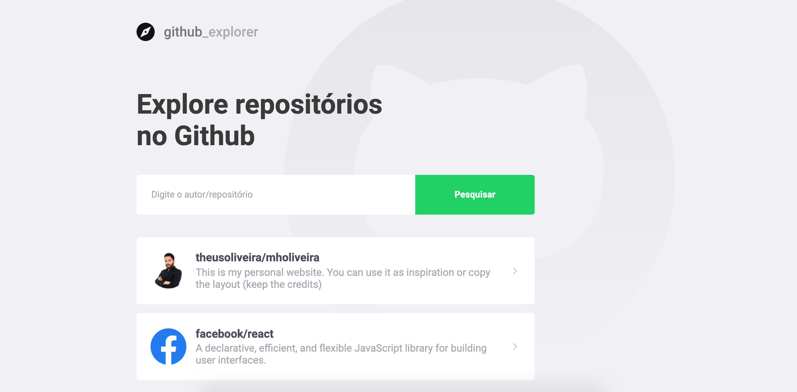
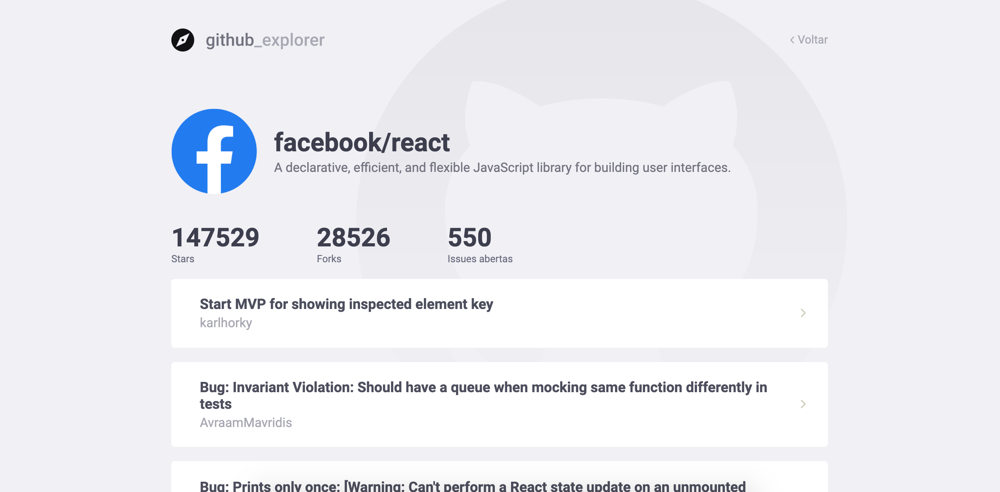

# Github Explorer

Interface built on ReactJS for listing repositories and open issues for each repository.

##### List of repositories



##### Details and open issues in the



## Getting Started

#### Yarn
You can install Yarn by following [these instructions](https://classic.yarnpkg.com/en/docs/getting-started).

After instalition, try typing yarn -v into your command line. You should get a response with the version of Yarn.

## Deploy

After cloning the repository, you need to install the dependencies before running the application. Follow this steps:
* Run ```yarn``` to install dependencies;
* Run ```yarn start``` to start de aplication.

## Author

[Matheus Oliveira](http://mholiveira.com/)
